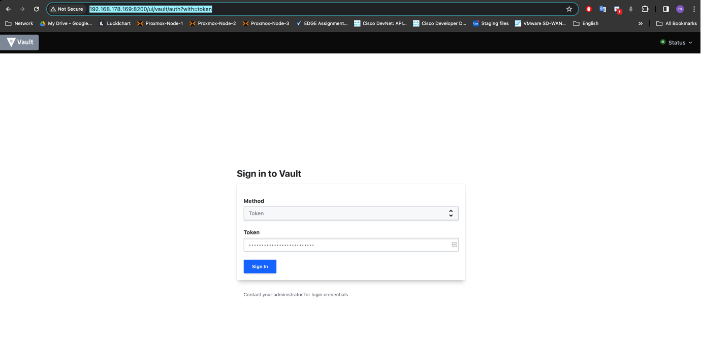
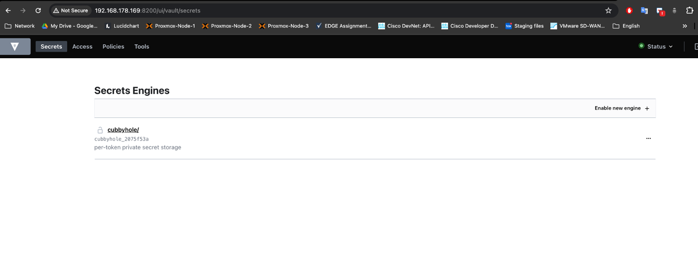

# Vault Docker Setup

This repository contains a Docker setup for running a Vault server.

## Components

- `Dockerfile`: This file contains the instructions to build a Docker image for the Vault server. The image is based on Alpine Linux 3.14 and includes Vault version 1.8.2.

- `docker-compose.yml`: This file is used to define services, networks, and volumes for docker-compose.

- `vault-config.json`: This is the configuration file for the Vault server.

## Vault Configuration

The Vault server uses file storage backend. The data is stored in `vault/data` directory.

The server listens on all network interfaces (0.0.0.0) on port 8200. TLS is disabled for simplicity.

The UI is enabled and `mlock` is disabled to avoid locking memory.


## Environment Variables
Both are in docker-compose file
- `VAULT_ADDR`: The address of the Vault server.
- `VAULT_API_ADDR`: The address of the Vault server  for API requests.


## How to Run

1. Clone the Repo
```shell 
    git clone https://github.com/melihteke/vault.git
```

2. Build the Docker image by running the following command:

    ```bash
    (.venv) make build
    docker build -t mteke/vault-filesystem:0.1 .
    [+] Building 0.6s (10/10) FINISHED                                                                                      docker:desktop-linux
    => [internal] load build definition from Dockerfile                                                                                    0.0s
    => => transferring dockerfile: 735B                                                                                                    0.0s
    => [internal] load metadata for docker.io/library/alpine:3.14                                                                          0.6s
    => [internal] load .dockerignore                                                                                                       0.0s
    => => transferring context: 2B                                                                                                         0.0s
    => [1/5] FROM docker.io/library/alpine:3.14@sha256:0f2d5c38dd7a4f4f733e688e3a6733cb5ab1ac6e3cb4603a5dd564e5bfb80eed                    0.0s
    => [internal] load build context                                                                                                       0.0s
    => => transferring context: 72B                                                                                                        0.0s
    => CACHED [2/5] RUN mkdir /vault                                                                                                       0.0s
    => CACHED [3/5] RUN apk --no-cache add       bash       ca-certificates       wget       curl                                          0.0s
    => CACHED [4/5] RUN wget --quiet --output-document=/tmp/vault.zip https://releases.hashicorp.com/vault/1.8.2/vault_1.8.2_linux_amd64.  0.0s
    => CACHED [5/5] COPY ./config/vault-config.json /vault/config/vault-config.json                                                        0.0s
    => exporting to image                                                                                                                  0.0s
    => => exporting layers                                                                                                                 0.0s
    => => writing image sha256:ac68e80685b5a4440e165d45c2a8ec41cbee7a3a6994e61969c14ff1b96bc184                                            0.0s
    => => naming to docker.io/mteke/vault-filesystem:0.1   
    ```

3. Run the Docker container using docker-compose:

    ```bash
    (.venv) make launch
    docker-compose up -d vault-filesystem
    [+] Running 1/2
    ⠹ Network vault_default               Created                                                                                          0.2s 
    ✔ Container vault-vault-filesystem-1  Started    
    ```

The Vault server will be accessible at `http://127.0.0.1:8200`.

4. Attach to Container
```bash
(.venv) make attach
docker exec -it vault-vault-filesystem-1 /bin/sh
/ # 
```

5. Vault Initialization

```bash
/ # vault status
Key                Value
---                -----
Seal Type          shamir
Initialized        false
Sealed             true
Total Shares       0
Threshold          0
Unseal Progress    0/0
Unseal Nonce       n/a
Version            1.8.2
Storage Type       file
HA Enabled         false
/ # vault operator init
Unseal Key 1: zECDUPUh++oqx6dC0jKpQKPZttxJb+jVYn/9/DyJ0pUK
Unseal Key 2: 0Rawi7WxcQOK6w5mNYde03KjrtZoXWH5EdvBP/NZ9CGk
Unseal Key 3: E8VECbOQ/posqMF5W3tn+1SpPHauvabI1Kffhp9ONRIF
Unseal Key 4: XqdqW1cGq2D9NKdjE8ctQzmA4E9lHjEfv7tOeN0Uoxju
Unseal Key 5: FeJN3I+fU+QnzQFnGWlf9C5RLl6dN8S1sQYbLM8D4vav

Initial Root Token: s.UhudItkyEoBQl31yg1hLQ31i

Vault initialized with 5 key shares and a key threshold of 3. Please securely
distribute the key shares printed above. When the Vault is re-sealed,
restarted, or stopped, you must supply at least 3 of these keys to unseal it
before it can start servicing requests.

Vault does not store the generated master key. Without at least 3 keys to
reconstruct the master key, Vault will remain permanently sealed!

It is possible to generate new unseal keys, provided you have a quorum of
existing unseal keys shares. See "vault operator rekey" for more information.
/ # 
/ # 
```

6. Unseal Vault

```bash
/ # vault operator unseal
Unseal Key (will be hidden): 
Key                Value
---                -----
Seal Type          shamir
Initialized        true
Sealed             true
Total Shares       5
Threshold          3
Unseal Progress    1/3
Unseal Nonce       c3685ac4-1ba6-f8dc-bc7d-36cdc51dc697
Version            1.8.2
Storage Type       file
HA Enabled         false
/ # vault operator unseal
Unseal Key (will be hidden): 
Key                Value
---                -----
Seal Type          shamir
Initialized        true
Sealed             true
Total Shares       5
Threshold          3
Unseal Progress    2/3
Unseal Nonce       c3685ac4-1ba6-f8dc-bc7d-36cdc51dc697
Version            1.8.2
Storage Type       file
HA Enabled         false
/ # vault operator unseal
Unseal Key (will be hidden): 
Key             Value
---             -----
Seal Type       shamir
Initialized     true
Sealed          false
Total Shares    5
Threshold       3
Version         1.8.2
Storage Type    file
Cluster Name    vault-cluster-ca26eabb
Cluster ID      6f058db8-2ada-c626-dd14-0ccafd91ee98
HA Enabled      false
/ # 
/ # 
/ # vault operator unseal
Unseal Key (will be hidden): 
Key             Value
---             -----
Seal Type       shamir
Initialized     true
Sealed          false
Total Shares    5
Threshold       3
Version         1.8.2
Storage Type    file
Cluster Name    vault-cluster-ca26eabb
Cluster ID      6f058db8-2ada-c626-dd14-0ccafd91ee98
HA Enabled      false
/ # 
/ # 
/ # vault operator unseal
Unseal Key (will be hidden): 
Key             Value
---             -----
Seal Type       shamir
Initialized     true
Sealed          false
Total Shares    5
Threshold       3
Version         1.8.2
Storage Type    file
Cluster Name    vault-cluster-ca26eabb
Cluster ID      6f058db8-2ada-c626-dd14-0ccafd91ee98
HA Enabled      false
/ # 
```

7. Login via Vault CLI

```bash
/ # vault login
Token (will be hidden): 
Success! You are now authenticated. The token information displayed below
is already stored in the token helper. You do NOT need to run "vault login"
again. Future Vault requests will automatically use this token.

Key                  Value
---                  -----
token                s.UhudItkyEoBQl31yg1hLQ31i
token_accessor       1PwQoXyHa9icdNVmzfiHNHPM
token_duration       ∞
token_renewable      false
token_policies       ["root"]
identity_policies    []
policies             ["root"]
/ # 
```

8. Connect Vault GUI

```bash
http://<host-device-ip-address>:8200/
```



