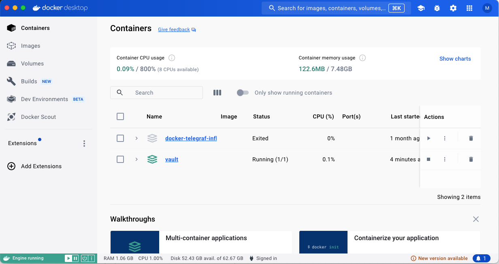

# Vault Docker Setup

This repository contains a Docker setup for running a Vault server.

## Components

- `Dockerfile`: This file contains the instructions to build a Docker image for the Vault server. The image is based on Alpine Linux 3.14 and includes Vault version 1.8.2.

- `docker-compose.yml`: This file is used to define services, networks, and volumes for docker-compose.

- `vault-config.json`: This is the configuration file for the Vault server.

## How to Run

1. Clone the Repo
```shell 
    git clone https://github.com/melihteke/vault.git
```

2. Build the Docker image by running the following command:

    ```bash
    (.venv) make build
    docker build -t mteke/vault-filesystem:0.1 .
    [+] Building 0.6s (10/10) FINISHED                                                                                      docker:desktop-linux
    => [internal] load build definition from Dockerfile                                                                                    0.0s
    => => transferring dockerfile: 735B                                                                                                    0.0s
    => [internal] load metadata for docker.io/library/alpine:3.14                                                                          0.6s
    => [internal] load .dockerignore                                                                                                       0.0s
    => => transferring context: 2B                                                                                                         0.0s
    => [1/5] FROM docker.io/library/alpine:3.14@sha256:0f2d5c38dd7a4f4f733e688e3a6733cb5ab1ac6e3cb4603a5dd564e5bfb80eed                    0.0s
    => [internal] load build context                                                                                                       0.0s
    => => transferring context: 72B                                                                                                        0.0s
    => CACHED [2/5] RUN mkdir /vault                                                                                                       0.0s
    => CACHED [3/5] RUN apk --no-cache add       bash       ca-certificates       wget       curl                                          0.0s
    => CACHED [4/5] RUN wget --quiet --output-document=/tmp/vault.zip https://releases.hashicorp.com/vault/1.8.2/vault_1.8.2_linux_amd64.  0.0s
    => CACHED [5/5] COPY ./config/vault-config.json /vault/config/vault-config.json                                                        0.0s
    => exporting to image                                                                                                                  0.0s
    => => exporting layers                                                                                                                 0.0s
    => => writing image sha256:ac68e80685b5a4440e165d45c2a8ec41cbee7a3a6994e61969c14ff1b96bc184                                            0.0s
    => => naming to docker.io/mteke/vault-filesystem:0.1   
    ```

2. Run the Docker container using docker-compose:

    ```bash
    (.venv) make launch
    docker-compose up -d vault-filesystem
    [+] Running 1/2
    ⠹ Network vault_default               Created                                                                                          0.2s 
    ✔ Container vault-vault-filesystem-1  Started    
    ```

The Vault server will be accessible at `http://127.0.0.1:8200`.

## Vault Configuration

The Vault server uses file storage backend. The data is stored in `vault/data` directory.

The server listens on all network interfaces (0.0.0.0) on port 8200. TLS is disabled for simplicity.

The UI is enabled and `mlock` is disabled to avoid locking memory.



## Environment Variables
Both are in docker-compose file
- `VAULT_ADDR`: The address of the Vault server.
- `VAULT_API_ADDR`: The address of the Vault server  for API requests.

## Connect to 

The Vault server is exposed on port 8200.


## Note

This setup is intended for development purposes only. For production environments, consider using a secure storage backend and enable TLS.